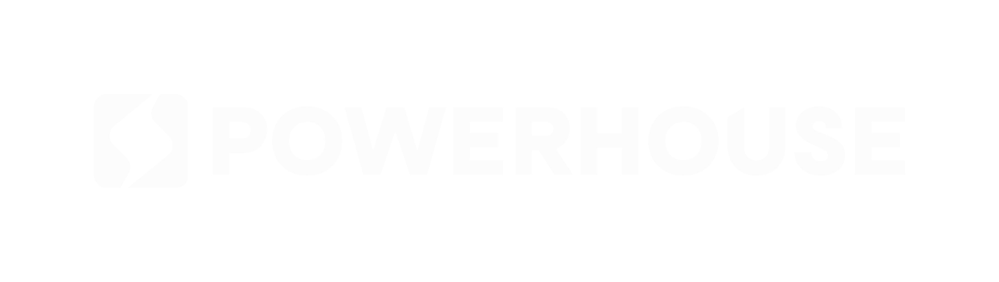

# Powerhouse Decentralized Operations Platform



## 🚀 Overview

The Powerhouse Decentralized Operations Platform is a modern web application built with Next.js that provides organizations with a decentralized approach to operations management. It offers a seamless way to connect teams, processes, and systems across your organization.

## 📋 Features

- **Decentralized Architecture**: Distribute operational capabilities across your organization
- **Seamless Integration**: Connect with existing systems and workflows
- **Real-time Collaboration**: Work together with team members regardless of location
- **Customizable Workflows**: Adapt the platform to your specific operational needs
- **Analytics Dashboard**: Gain insights into operational efficiency and performance
- **Responsive Design**: Access from any device with a fully responsive interface

## 🛠️ Getting Started

### Prerequisites

- Node.js 18.0.0 or later
- npm or yarn package manager

### Installation

1. Clone the repository:

```bash
git clone https://github.com/0xkilgore/decentralized-operations-platform.git
cd decentralized-operations-platform
```

2. Install dependencies:

```bash
npm install
# or
yarn install
```

3. Run the development server:

```bash
npm run dev
# or
yarn dev
```

4. Open [http://localhost:3000](http://localhost:3000) in your browser.

## 🎨 Customization

### Colors

The primary color scheme is defined in `tailwind.config.ts`. The main accent color is `neon-green (#34eb4f)`.

To change the color scheme:

1. Open `tailwind.config.ts`
2. Modify the color values under the `colors` section
3. Update any direct color references in the components

### Content

The main content sections are organized as separate components in the `components` directory:

- `header.tsx` - Navigation and logo
- `hero.tsx` - Main hero section
- `features.tsx` - "What It Includes" section
- `benefits.tsx` - "Why It Matters" section
- `audience.tsx` - "Who It's For" section
- `case-study.tsx` - Example implementation
- `ecosystem.tsx` - "Part of the Powerhouse Stack" section
- `contact.tsx` - Contact form
- `footer.tsx` - Footer with links and copyright

Edit these files to update the content of each section.

### Images and Logos

- Replace logos in the `public/logos` directory
- Update product screenshots in the `public/images` directory
- Maintain the same filenames or update the references in the components

## 📱 Responsive Design

The site is fully responsive with optimizations for:

- Mobile devices (< 768px)
- Tablets (768px - 1024px)
- Desktops (> 1024px)

The responsive behavior is handled through Tailwind's responsive utility classes.

## 🚢 Deployment

### Deploy to Vercel

The easiest way to deploy:

1. Push your code to a GitHub repository
2. Import the project in Vercel
3. Click "Deploy"

### Manual Deployment

1. Build the production version:

```bash
npm run build
# or
yarn build
```

2. Start the production server:

```bash
npm start
# or
yarn start
```

## 🤝 Contributing

Contributions are welcome! Please feel free to submit a Pull Request.

1. Fork the repository
2. Create your feature branch (`git checkout -b feature/amazing-feature`)
3. Commit your changes (`git commit -m 'Add some amazing feature'`)
4. Push to the branch (`git push origin feature/amazing-feature`)
5. Open a Pull Request

## 📄 License

This project is licensed under the MIT License - see the LICENSE file for details.

## 🙏 Acknowledgements

- Design inspired by [powerhouse.inc/connect](https://www.powerhouse.inc/connect)
- Built with [Next.js](https://nextjs.org/) and [Tailwind CSS](https://tailwindcss.com/)
- Icons from [Lucide React](https://lucide.dev/) 